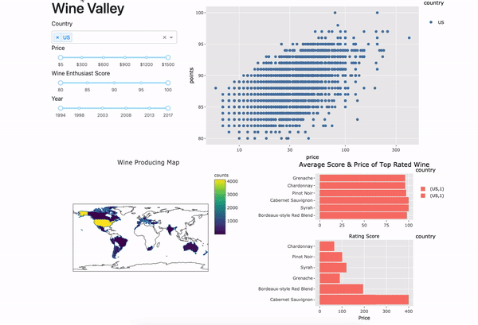

# DSCI\_532\_Group15\_wine-R

# Wine Review Data Visualization Team Project

Deployed dashboard in herokuapp: <http://winevalley-r.herokuapp.com/>

## Welcome!

-   [What is *Wine Valley*?](#what-wine-valley-is-all-about)
-   [How can you help?](#helping-us-out)
-   [Get in touch](#contact-us)
-   [Initial Proposal](#initial-proposal)

## What Wine Valley is All About {#what-wine-valley-is-all-about}

Have you been trying to track down the perfect wine for the perfect occasion? Look no further! Our app *Wine Valley* will help you do just that! Apply various filters to search through a database of thousands of different wines to find exactly what you're looking for! With *Wine Valley* you can filter by country, price, Wine Enthusiast score and year. Track down the perfect beverage for any occasion! Try it [here](http://winevalley-r.herokuapp.com/)!!

By clicking on the different sliders and dropdown filter the data to find whatever kind of wine you're interested in! See our map and charts that are updated in real time according to your selections!

## Helping us out {#helping-us-out}

Would you like to help us improve our app? Here are some instructions on how to get started.

### Installation

First, make sure you have all of the required dependencies installed.

First install all of the required packages to be able to run our dashboard.

| Package  | Installation command         |
|----------|------------------------------|
| dash     | install.packages('dash')     |
| gunicorn | pip install gunicorn         |
| devtools | install.packages("devtools") |
| dplyr    | install.packages("dplyr")    |
| ggplot2  | install.packages("ggplot2")  |
| plotly   | install.packages("plotly")   |

Then simply clone our repo and run app.R in your terminal. A local version of the app will run in your default local host ip and port which can then be opened in any browser. Further instructions are available [here](https://dashr.plotly.com/deployment) if you run into any issues.

If you can think of ways to make our sliders more intuitive or improve the presentation of our charts, then don't hesitate to contact us.

## Contact us {#contact-us}

Feel free to open an issue in this github repo if you would like to report a bug, error, or suggestion you have for how we can improve this project.

## Initial Proposal {#initial-proposal}

The left side of the screen will display interactive sliders (vintage year, price, user rating) and drop down (country, variety) menus for different search criteria as well as a keyword search bar to look for wine of a specific name. The bottom left of the screen will display an interactive map highlighting where all of the searched wines are from. The upper middle of the screen will display the results of the search as a scrollable list of wine that meet the specified criteria, with the title and some summary information about each wine visible. A dropdown will be available at the top to change how these results are sorted (i.e. by price, score, etc.). If a wine is clicked on by the user a detailed description will be displayed in the top right of the screen including detailed information about each wine and it's provided review. Finally, the lower right of the screen will show summary statistics (i.e. histograms, line charts) about the search results with a dropdown menu to let you decide what features (price, score, etc.) are displayed by the charts.
